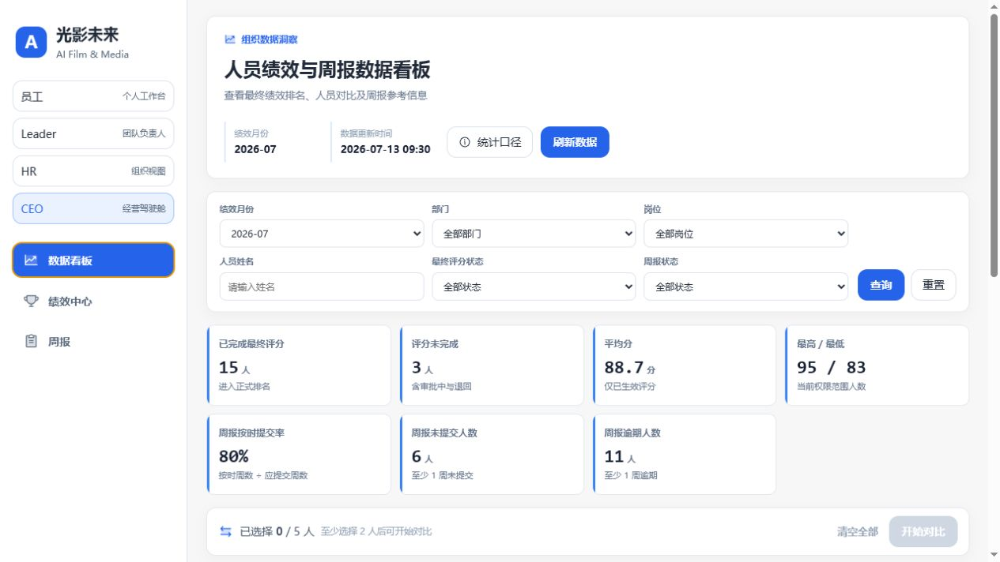
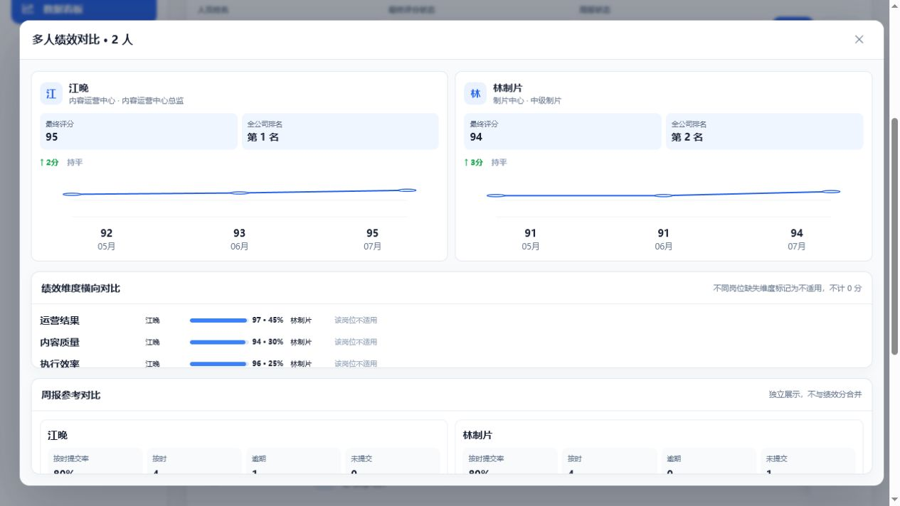
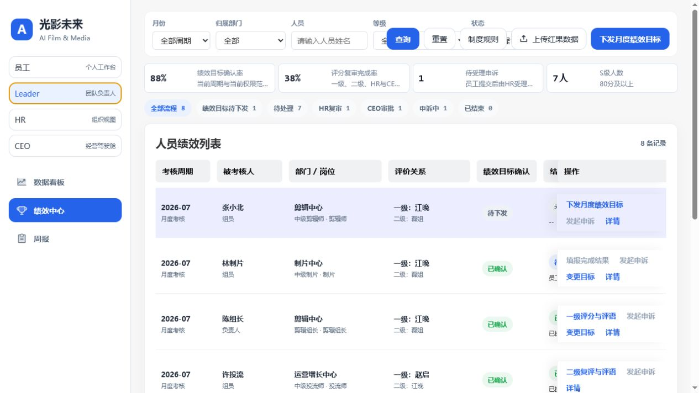
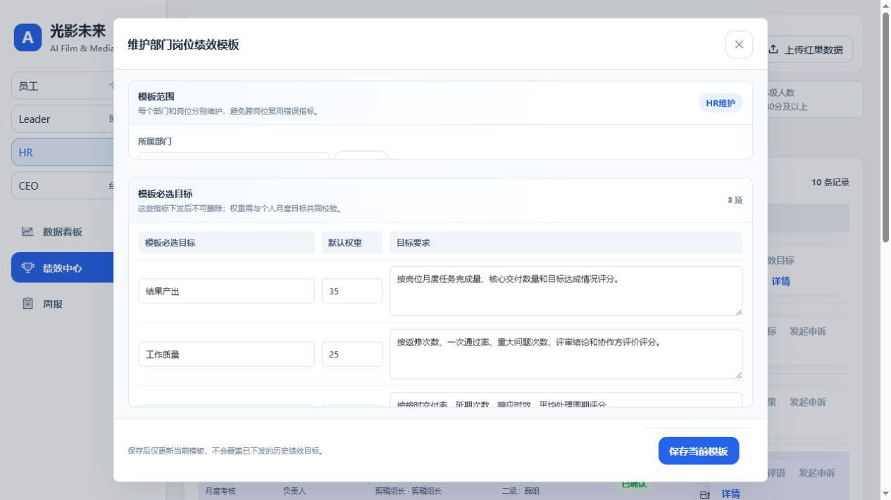
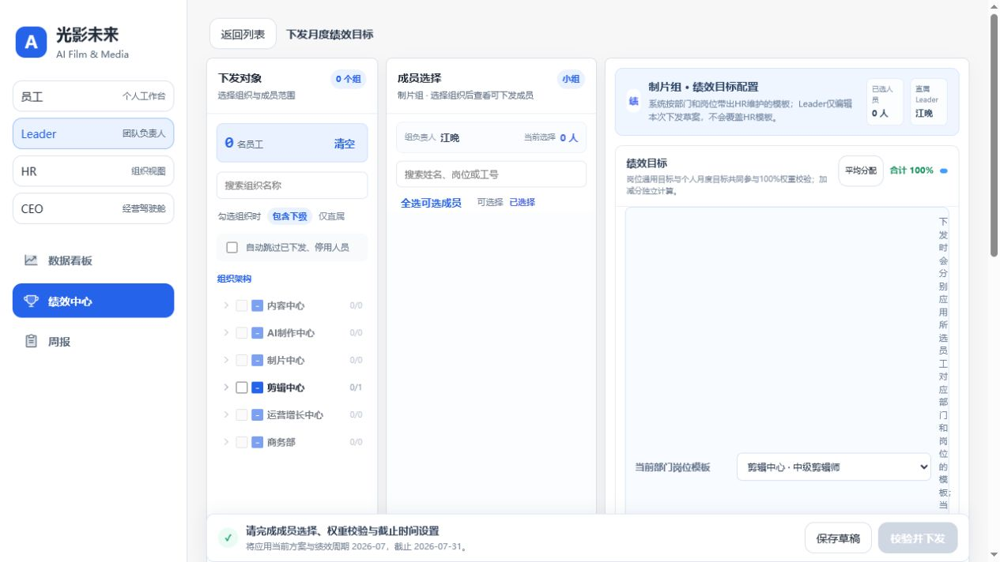
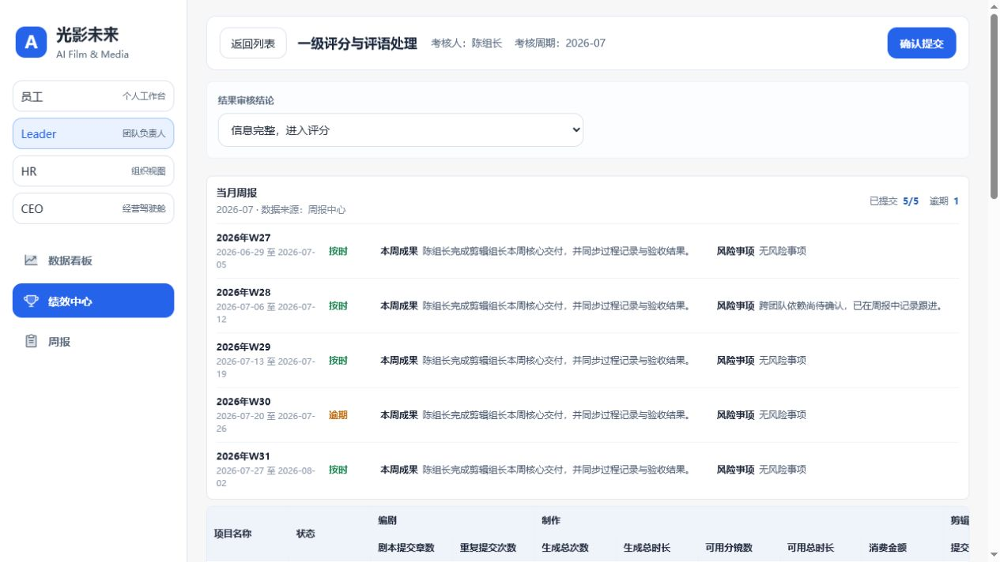
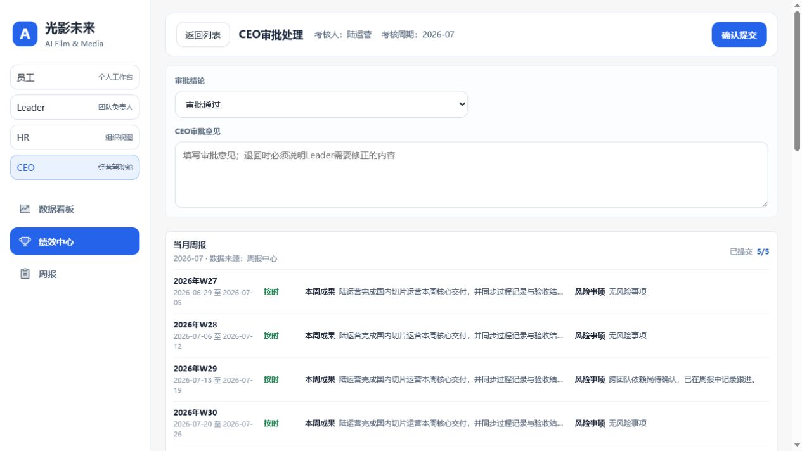
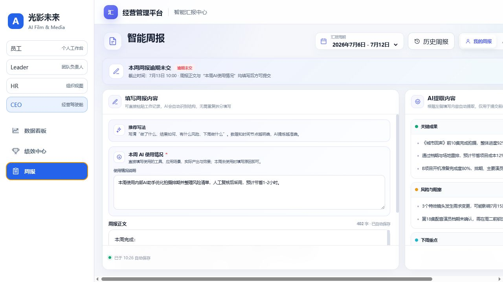
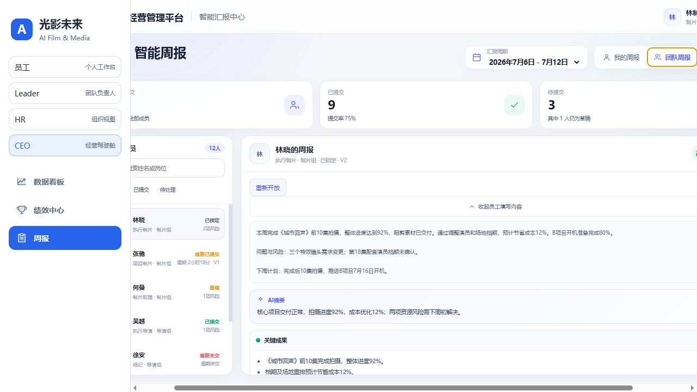
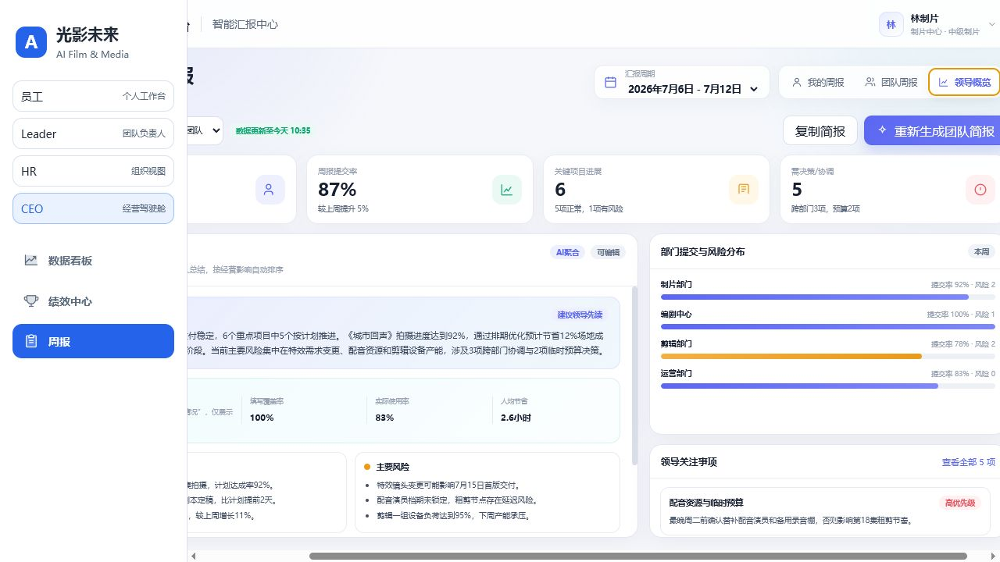

# 绩效与周报管理系统 PRD

| 项目 | 内容 |
| --- | --- |
| 产品名称 | 光影未来·绩效与周报管理系统 |
| 文档版本 | V1.0 |
| 基线日期 | 2026-07-13 |
| 目标读者 | 产品、前后端开发、测试、数据、运维 |
| 页面基线 | 当前 `kpi-bi-demo` 已实现页面；本文不重新设计界面 |
| 实现说明 | 当前为 React + 静态 HTML Demo；生产版本需补齐后端、数据库、鉴权、附件、消息和审计能力 |

## 1. 产品目标与范围

### 1.1 产品目标

建立“周报记录过程、绩效管理结果、数据看板辅助决策”的组织管理闭环：

1. 统一月度绩效目标、结果填报、逐级评分、审批、面谈、申诉和归档；
2. 统一个人周报、团队周报和领导经营简报；
3. 在权限范围内查看最终绩效排名、趋势、人员对比和周报异常；
4. 保证关键动作有权限校验、版本控制、操作日志和可追溯历史。

### 1.2 本期范围（P0）

- 统一身份、组织、岗位、上下级关系和角色权限；
- 数据看板：统计卡、筛选、排名、人员详情、2–5 人对比、周报参考；
- 绩效中心：模板、目标下发/确认/变更、结果填报、两级评分、HR 复审、CEO 审批、面谈、申诉、归档；
- 周报中心：草稿自动保存、AI 提取、提交/更新/锁定/补交、历史周报、团队查看、提醒、重新开放、领导概览；
- 红果作品数据 CSV 导入；
- 附件、消息待办、操作日志、版本与并发控制。

### 1.3 非本期范围

- 周报内容自动改变绩效得分；
- 薪酬、奖金、调薪和薪资核算；
- 独立移动 App；
- 在本 PRD 中重新设计现有页面或调整视觉规范。

## 2. 用户与权限

| 角色 | 数据范围 | 主要权限 | 禁止事项 |
| --- | --- | --- | --- |
| 员工 | 仅本人 | 确认/异议目标、填报结果、提交周报、发起申诉、查看本人看板 | 查看或处理他人记录、人员对比 |
| Leader | 本人及管理责任范围 | 下发/变更目标、一级或二级评分、加减分、面谈归档、查看团队周报、提醒/重新开放 | 处理责任范围外人员、代替 HR/CEO |
| HR | 全公司 | 维护岗位模板、HR 复审、申诉调查、异常管理、全员看板、重新开放周报 | 代替 Leader 评分或 CEO 裁决 |
| CEO | 全公司 | 最终审批、申诉最终裁决、经营看板 | 代替 Leader/HR 的前置节点 |

权限必须同时控制：页面入口、按钮可见/可用、服务端动作、数据行范围和导出范围。前端隐藏按钮不能代替服务端鉴权。

## 3. 信息架构

| 一级模块 | 页面/功能 |
| --- | --- |
| 数据看板 | 筛选与统计、全公司排名、人员详情、多人对比、统计口径 |
| 绩效中心 | 绩效列表、制度规则、红果导入、岗位模板、目标下发、目标/结果详情、评分、HR 复审、CEO 审批、面谈、申诉 |
| 周报 | 我的周报、历史周报、团队周报、领导概览、提交确认、重新开放 |

外层身份与周报身份在生产版本必须来自同一登录上下文；当前 Demo 的周报 iframe 使用固定员工数据，仅用于演示。

## 4. 核心业务流程

### 4.1 绩效主流程

```text
HR维护部门岗位模板
→ Leader下发月度绩效目标
→ 员工确认（或提出异议后重新下发）
→ 员工填报完成结果与证明
→ 一级Leader评分
→ [按配置可选] 二级Leader复评
→ HR复审
→ CEO审批
→ Leader反馈与面谈
→ 归档结束
```

关键退回：证明不足退回员工；评分/评语问题退回 Leader；CEO 不通过时退回 Leader，并重新经过 HR 与 CEO。

### 4.2 目标版本流程

```text
首次下发：待下发 → 待员工确认 → 已确认/进入结果填报
目标异议：待确认 → 异议处理中 → Leader调整重发 → 待确认
生效后变更：V1生效 → 生成待确认V2 → 员工确认后V2生效
                                      └→ 员工拒绝则V1继续生效
```

所有提交携带 `expectedVersion`；旧版本提交返回版本冲突，不得覆盖新数据。

### 4.3 申诉流程

```text
员工提交申诉与证据 → HR调查 → Leader补充评分依据 → CEO裁决
→ 驳回：原结果保留
→ 部分成立/成立：生成结果V2，V1归档保留
```

### 4.4 周报流程

```text
编辑草稿（自动保存）
→ 截止前提交V1 / 截止前更新V2+
→ 截止后自动锁定
→ Leader或HR填写原因重新开放
→ 员工提交新版本（逾期已提交）
```

未提交且超过截止时间为“逾期未交”；团队管理者只能看到草稿/未交状态，不能查看草稿正文。

## 5. 功能需求

### 5.1 数据看板（DB）



| ID | 需求 | 验收重点 |
| --- | --- | --- |
| DB-01 | 按月份、部门、岗位、姓名、最终评分状态、周报状态筛选 | 重置恢复默认；切换角色后自动应用数据范围 |
| DB-02 | 展示已完成/未完成、平均分、最高/最低、周报按时率、未交人数、逾期人数 | 绩效统计只使用最终已生效分数 |
| DB-03 | 展示全公司排名、最终分、环比、周报按时率和异常数 | 筛选不重新排名；未生效人员置后且无正式名次 |
| DB-04 | 打开人员详情 | 展示月度趋势、维度得分、周报成果/风险与数据状态 |
| DB-05 | 选择 2–5 人进行横向对比 | 员工不可对比；角色/月度变化清理无权或失效选择 |
| DB-06 | 展示统计口径和数据更新时间 | 无数据、部分数据、数据延迟必须有明确提示 |

排名采用竞赛排名：同分同名次，下一名次跳号（如 1、2、2、4）。Leader 看到的仍是全公司名次，不在团队内重排。



### 5.2 绩效中心列表（PF）



| ID | 需求 | 验收重点 |
| --- | --- | --- |
| PF-01 | 按月份、部门、人员、等级、流程状态筛选并分页 | 列表仅返回当前角色有权数据 |
| PF-02 | 展示目标确认、结果填报、两级评分、加减分、最终分、等级、流程和申诉状态 | 未生成数据使用“--”，不得伪造 0 分 |
| PF-03 | 提供全部、待下发、待处理、HR复审、CEO审批、申诉中、已结束页签 | 页签计数与筛选结果一致 |
| PF-04 | 展示四张指标卡 | 仅展示，不可点击；统计口径不受状态页签/等级/流程状态影响 |
| PF-05 | 打开详情 | 展示当前版本、历史版本、评分、申诉、操作日志和附件 |
| PF-06 | 上传红果 CSV | 校验必填列、空文件、有效行；按作品名称/作品ID关联项目并反馈成功/失败明细 |

指标卡口径：当前周期 × 当前角色范围 × 部门 × 人员。确认率排除“待下发/待确认/异议中”；评分复审完成率包括“待HR复审/待CEO审批/待面谈/已结束”。

### 5.3 岗位模板与目标下发（TM）



| ID | 需求 | 验收重点 |
| --- | --- | --- |
| TM-01 | HR 按“部门 + 岗位”新建、编辑模板 | 保存仅影响模板后续使用，不覆盖已下发历史目标 |
| TM-02 | 模板包含必选目标名称、默认权重、目标要求和独立加减分项 | 必选目标下发后不可删除 |
| TM-03 | Leader 按组织/成员批量下发，支持包含下级/仅直属、搜索、全选、跳过已下发/停用人员 | 服务端再次校验责任范围和人员状态 |
| TM-04 | 系统按人员部门岗位带出模板；Leader 可调整本次要求/权重并增删个人月度目标 | 本次草案不回写 HR 原模板 |
| TM-05 | 岗位通用目标 + 个人目标权重必须等于 100% | 不满足时禁止下发并展示当前合计 |
| TM-06 | 支持保存草稿、校验并下发 | 防重复提交；批量操作返回逐人结果 |



### 5.4 结果、评分与审批（SC）

| ID | 需求 | 验收重点 |
| --- | --- | --- |
| SC-01 | 员工逐项目标填写完成结果、说明、证明材料及项目/任务/周报引用 | 必填和附件校验；失败不清空输入 |
| SC-02 | Leader 审核结果；证明不足时填写原因退回员工 | Leader 不得静默改写员工原文；保留退回快照 |
| SC-03 | 一级/二级 Leader 按指标评分并填写评语 | 仅对应评价人可提交；分数边界 0–100 |
| SC-04 | 直属 Leader 录入加减分 | 累计 -10 至 +10；每条原因和证明必填 |
| SC-05 | HR 复审并提交 CEO，或退回 Leader | 记录意见、前后状态与快照 |
| SC-06 | CEO 审批通过或退回 Leader | 退回原因必填；通过后进入面谈 |
| SC-07 | Leader 提交面谈记录与改进计划后归档 | 归档后普通流程字段只读 |





评分规则：

```text
需要二级复评：单项目标分 = 一级评分 × 60% + 二级评分 × 40%
无需二级复评：单项目标分 = 一级评分
基础分 = Σ（单项目标分 × 权重）
最终分 = clamp（基础分 + 加减分，0，100）
```

计算保留两位小数，并以未取整分数判级：S=80–100，A=70–不足80，B=60–不足70，C=55–不足60，D=不足55。

### 5.5 申诉（AP）

| ID | 需求 | 验收重点 |
| --- | --- | --- |
| AP-01 | 员工提交申诉原因与证据 | 仅本人且满足可申诉状态 |
| AP-02 | HR 记录调查结论，Leader 可补充原评分依据 | 过程材料仅相关角色可见 |
| AP-03 | CEO 选择驳回/部分成立/成立并填写理由 | 成立或部分成立必须填写修正分数 |
| AP-04 | 调整后生成结果 V2 | V1 不删除；详情展示前后分数、等级、操作人和时间 |

### 5.6 周报中心（WR）



| ID | 需求 | 验收重点 |
| --- | --- | --- |
| WR-01 | 按周填写周报正文和“本周 AI 使用情况” | 两项均必填；内容变化自动保存草稿 |
| WR-02 | AI 提取关键成果、风险、下周重点、需支持事项 | 仅辅助提炼；提交前由员工确认，可编辑原文 |
| WR-03 | 截止前提交或更新周报 | 每次形成新版本；幂等、防重复、版本冲突提示 |
| WR-04 | 截止后锁定、逾期未交和逾期补交 | 状态按服务端时钟和 Asia/Shanghai 时区计算 |
| WR-05 | 历史周报 | 同时展示提交原文、AI 提炼、版本和时间，可带入历史下周计划 |
| WR-06 | 团队周报 | 支持搜索/状态筛选、查看正式内容、导出、提醒 |
| WR-07 | 重新开放 | 仅 Leader/HR；原因必填；旧版本保留，新提交生成 V2+ |
| WR-08 | 领导概览 | 按部门/团队聚合提交率、项目、风险、需决策事项和 AI 使用洞察 |

Leader 可看到“草稿/逾期未交”状态并发送提醒，但不得读取草稿正文、AI 摘要、成果、风险和计划。





### 5.7 日志、通知与反馈（OP）

- 目标下发/确认/异议/变更、结果提交/退回、评分、加减分、HR/CEO处理、面谈、申诉、周报提交/更新/重开/补交必须写操作日志；
- 日志至少记录业务ID、动作、操作者、角色、时间、前后状态、版本、原因、请求追踪号；日志不可由普通用户修改；
- 待确认、待评分、退回、审批、申诉、周报提醒/逾期/重开产生站内待办；具体短信/企微/邮件渠道由实施方确认；
- 所有关键提交提供：提交中、成功、校验失败、无权限、重复提交、版本冲突、超时和重试反馈。

## 6. 状态与数据规则

### 6.1 绩效状态

`绩效目标待下发`、`待员工确认绩效目标`、`目标异议处理中`、`绩效目标已生效`、`待员工填报结果`、`待一级领导评分`、`待二级领导复评`、`待HR复审`、`待CEO审批`、`待反馈与面谈`、`申诉已提交`、`HR调查中`、`待CEO裁决`、`已结束`。

### 6.2 周报状态

`草稿`、`已提交`、`已锁定`、`逾期未交`、`逾期已提交`、`待修改`。

### 6.3 看板口径

- 只有最终节点已批准且未被退回的分数进入正式排名；
- 平均、最高、最低仅统计已生效分数；
- 周报按时率 = 按时提交周数 ÷ 应提交周数；异常数 = 逾期 + 未提交；
- “未交人数/逾期人数”为至少发生 1 周对应异常的去重人数；
- 不同岗位缺失的绩效维度显示“不适用”，不得按 0 分处理；
- 周报只作参考，不参与绩效公式。

## 7. 核心数据对象

| 对象 | 关键字段 |
| --- | --- |
| 用户/组织 | userId、employeeId、姓名、部门、岗位、在职状态、上下级关系、角色 |
| 绩效模板 | templateId、部门、岗位、指标、权重、要求、版本、启停状态 |
| 绩效周期 | cycleId、月份、开始/截止时间、状态、适用组织 |
| 绩效记录 | recordId、员工、周期、评价关系、当前状态、版本、最终分/等级 |
| 目标版本 | targetVersion、目标项、权重、变更原因、确认状态、操作人/时间 |
| 评分项 | 指标、权重、自评结果、两级分数/评语、综合分、数据来源 |
| 加减分 | 分值、原因、证明附件、录入人、时间 |
| 申诉 | appealId、原因、证据、调查、裁决、修正结果、版本 |
| 周报 | employeeId + 周期唯一键、截止时间、状态、当前版本、原文、AI使用 |
| 周报版本 | reportVersion、提交时间、成果、风险、计划、AI提炼、逾期时长 |
| 操作日志 | 业务类型/ID、动作、操作者、前后状态、版本、原因、追踪号 |

附件需存储文件名、类型、大小、哈希、上传人、上传时间、访问权限和对象关联；敏感导出应记录审计并支持水印。

## 8. 服务与集成要求

生产开发至少拆分以下服务能力（接口形式由技术方案确定）：

1. 统一认证、组织架构、岗位、上下级关系和数据范围；
2. 绩效模板、周期、目标版本、评分、申诉和工作流命令；
3. 周报草稿、版本、截止锁定、重开、AI 提取和领导聚合；
4. 看板查询、公司排名、人员详情和多人对比；
5. 附件上传/下载、CSV 导入任务和失败明细；
6. 待办/通知、审计日志和数据质量监控。

所有写接口必须支持：服务端权限校验、`expectedVersion` 乐观锁、`requestId` 幂等、事务、统一错误码和追踪号。批量下发/导入应异步执行并可查询任务状态。

红果 CSV 必填列：作品名称、剧目类型、剧目体裁、作品封面、作品集数、作品ID、发布时间、作品总时长、累计点击率、首集完播进度、10/30/60分钟完播率、人均播放集数。

## 9. 非功能要求

| 类别 | P0 要求 |
| --- | --- |
| 安全 | SSO、最小权限、行级数据权限、附件鉴权、敏感字段脱敏、服务端防越权 |
| 一致性 | 服务端状态机；评分/版本/审批事务一致；禁止前端单方面推进状态 |
| 审计 | 关键日志不可篡改；支持按人、业务ID、时间和动作查询 |
| 性能建议基线 | 常规列表/详情 P95 ≤ 2s；普通提交 P95 ≤ 3s；长任务异步化并展示进度 |
| 可用性 | 写操作失败可安全重试；不得丢失已填写内容；提供空、错、无权、延迟状态 |
| 兼容性 | 桌面 Web，支持企业统一要求的最新版 Chrome/Edge；表格支持横向滚动 |
| 时间 | 统一使用 Asia/Shanghai；截止与逾期由服务端计算 |
| 可观测性 | 请求追踪、错误率、工作流积压、数据延迟、AI失败率、导入失败率告警 |

## 10. 验收清单

1. 分别以员工、Leader、HR、CEO 登录，入口、按钮、数据范围与服务端鉴权一致；
2. 目标权重不等于 100% 时禁止下发；加减分超出 -10～+10 时禁止提交；
3. 员工目标异议、生效后 V2 变更、拒绝 V2 保留 V1 均可闭环；
4. 需要/无需二级复评两条路径均按正确公式和节点流转；
5. 所有退回原因必填，退回后原内容与快照可追溯；
6. S/A/B/C/D 边界值和两位小数计算正确；
7. 旧版本/重复请求不覆盖新数据，返回明确错误；
8. 申诉成立/部分成立生成结果 V2，V1 仍可查看；
9. 周报截止前更新、截止后锁定、重新开放、逾期补交及版本日志正确；
10. Leader 无法查看草稿正文；员工无法查看他人周报或发起人员对比；
11. 公司排名、并列名次、环比、周报异常口径正确，筛选不重新排名；
12. 周报提交不会改变任何绩效分数；
13. CSV 缺列、空文件、坏行、重复作品和部分失败均有反馈；
14. 无数据、数据延迟、无权限、网络失败、超时和重复点击状态可恢复；
15. 关键动作均产生操作日志、待办/通知和请求追踪号。

## 11. 当前实现边界与开发补齐项

| 当前 Demo | 生产版本必须补齐 |
| --- | --- |
| 绩效数据为前端种子与 React 内存，刷新恢复 | 数据库持久化、事务、备份、历史迁移 |
| 周报保存在浏览器 localStorage | 服务端存储、跨设备/跨用户同步、草稿安全 |
| 身份切换为页面模拟，周报使用固定身份 | SSO、统一身份上下文、组织/岗位/上下级同步 |
| 权限与工作流主要为前端逻辑 | 服务端 RBAC/数据范围与状态机 |
| 附件、消息、审计为展示或占位 | 对象存储、消息待办、不可篡改审计 |
| AI 提取/领导简报为演示内容 | 模型服务、提示词版本、超时降级、人工确认和内容安全 |
| 看板为稳定 Mock | 指标层、刷新调度、数据质量、延迟/缺失提示 |

## 12. 待项目确认（不阻塞前端按现页面开发）

- 周报和绩效通知采用站内、企业微信、邮件中的哪些渠道；
- 附件类型、单文件大小、保留年限和导出水印规则；
- AI 模型供应方、提示词管理权限、生成超时和费用上限；
- 组织数据源、人员离职/调岗后的在途流程处理规则；
- 绩效归档后的申诉有效期及管理员纠错授权。

以上事项需在后端联调前确认并写入配置或业务规则，不应由前端写死。
